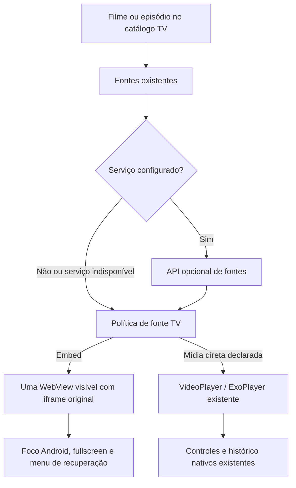

# CINEY Player Engine — primeira implementação TV

Branch: `feat/tv-player-engine`. Escopo: Android TV através do `cinemax` compartilhado, usado por `cinemax_tv` via dependência local. Não há publicação nem merge em `main`. O player do celular, Cast/DLNA, autenticação, favoritos e catálogo mantêm seus fluxos existentes.

## Investigação e diagnóstico

Foram examinados `cinemax/lib/features/player`, o resolver de plugins, o host `cinemax_tv`, o plugin local `embed_media_observer`, `receiver/` e o plano `tv-native-playback.md`. O receiver é destinado a Cast e não é necessário para a reprodução no app instalado na TV.

A TV anterior abria a URL do provedor como documento principal em uma WebView escondida, tentando obter mídia em 8 segundos. Isso não equivale à integração por iframe documentada. O fallback ligava o carregamento ao sinal `session.ready`; quando o iframe era opaco e não emitia telemetria, a cobertura preta podia continuar sobre a página. São problemas identificados no código; a causa específica na TCL ainda depende de logs e teste do aparelho.

Documentação consultada em 09/10/2026:

- [SuperFlix](https://superflixapi.quest/doc): integração por iframe; filmes TMDB/IMDb em `/filme/{id}` e séries TMDB em `/serie/{id}/{temporada}/{episodio}`. A documentação também descreve catálogo, não uma API de mídia direta.
- [EmbedMovies](https://embedmovies.org/): iframe original; filmes em `https://myembed.biz/filme/{id}` e episódios em `/serie/{id}/{temporada}/{episodio}`. Não disponibiliza MP4/M3U8 para player externo nessa integração.
- [WebView Flutter Android: fullscreen](https://pub.dev/documentation/webview_flutter_android/latest/webview_flutter_android/AndroidWebViewController/setCustomWidgetCallbacks.html) e APIs instaladas da versão 4.12.0.
- [Android WebView.onPause](https://developer.android.com/reference/android/webkit/WebView#onPause()): pausar a WebView não garante interrupção de todo JavaScript. Por isso o app descarrega o documento ao ir para segundo plano.

Não há extração de fluxos, cliques por coordenadas, acesso ao DOM interno de iframe externo, falsificação de cabeçalhos de iframe ou desvio de restrições.

## Arquitetura implementada



O backend é um plano de controle opcional, sem tráfego de vídeo. Fontes e provedores podem mudar no arquivo de configuração do serviço. `NO_SOURCES` não ativa fallback; uma falha de conexão/protocolo permite fontes locais. O endereço do serviço é configurado uma vez na compilação TV. Não há dependência de PC para o APK padrão, que usa fontes locais.

Na TV, uma fonte embed entra diretamente no novo `TvEmbedPlayer`. Fontes declaradas como mídia direta usam o player nativo existente. MIMEs HLS/DASH são preservados como `formatHint`, inclusive em URLs sem extensão. URLs dos provedores conhecidos permanecem embed mesmo se uma query contiver `.mp4`.

O adaptador `TvEmbedHost` concentra a configuração Android. O contrato HTTP e o documento iframe podem ser reutilizados; Tizen/webOS ainda precisam de um host/player e empacotamento específicos. Este trabalho não gera apps Samsung/LG.

## Comportamento na TV

- A página fica visível desde a abertura. Uma barra discreta indica carregamento por até 25 segundos; não há cobertura preta esperando telemetria de vídeo.
- Carregamento do documento **não** significa vídeo reproduzindo. Ao expirar o prazo, o menu oferece recarregar/trocar/sair. Se o documento terminar, mas o fornecedor mostrar tela preta, Voltar/Menu permite a mesma recuperação.
- JavaScript e cookies de terceiros são habilitados para o player; permissões de câmera, microfone e outros recursos solicitados são negadas. O iframe permite autoplay, encrypted-media, picture-in-picture e fullscreen; o provedor continua decidindo como iniciar a mídia. DRM que exigir permissões/licenciamento adicional não foi integrado.
- “Ir ao player” entrega o foco à WebView. D-Pad, OK e Play/Pause são encaminhados como teclas Android, sem toques artificiais. A resposta depende da navegação e dos controles que o provedor disponibiliza.
- Voltar fecha fullscreen/abre as opções antes de sair. Menu também abre as opções. Fullscreen usa os callbacks nativos do WebView Flutter e devolve a visualização ao provedor ao fechar.
- Erros HTTP da URL original e erros do documento têm mensagem recuperável; falhas de anúncios/subrecursos não são tratadas automaticamente como falha do filme. Navegação externa da janela principal é bloqueada, sem abrir aplicativos ou popups externos.
- Trocar fonte, fechar ou ir para segundo plano descarrega o documento e remove listeners/timers. Ao voltar do segundo plano, é necessário recarregar. Cookies não são apagados; a sessão de conta do CiNey permanece separada.
- O histórico salva a escolha do provedor e preserva posições anteriores. Em iframes opacos, o CiNey não mede tempo, não aplica seek exato e não detecta término: retomada depende do player original; avanço de episódio é manual. Mídia nativa mantém histórico, retomada e avanço automático existentes.
- Há uma WebView por sessão, sem sniffer, polling de DOM ou proxy de mídia. Consumo real de RAM/CPU e estabilidade prolongada não foram medidos na TCL.

## Arquivos

| Área | Arquivos e função |
| --- | --- |
| Integração | `cinemax/lib/features/player/presentation/player_screen.dart`: seleção TV, remoção do sniffer TV, histórico do provedor e formato nativo. |
| Motor TV | `cinemax/lib/features/player/tv/tv_source_policy.dart`, `tv_engine_client.dart`: classificação e API opcional. |
| Embed TV | `tv_embed_document.dart`, `tv_embed_player.dart`, `tv_embed_host.dart`, `tv_webview_bridge.dart`: iframe, interface, adaptação Android e canal. |
| Android | `cinemax/packages/embed_media_observer/android/src/main/java/com/ciney/embedmedia/TvWebViewHandler.java`: foco, teclas e liberação. `EmbedMediaObserverPlugin.java` registra o canal adicional. |
| Serviço | `player_engine/src/{registry,app,server}.ts`, `config/`, `package.json`, lockfile e `tsconfig.json`. |
| Testes | `cinemax/test/tv_engine_test.dart`, `tv_embed_player_test.dart`; `player_engine/test/`, `integration/`. Interface WebView adicionada apenas às dependências de teste de `cinemax`. |
| Documentação | Este arquivo, `player_engine/README.md` e aviso no plano antigo `tv-native-playback.md`. |

Arquivos protegidos de Cast e `MainActivity` não foram alterados.

## Backend no Windows

```powershell
Set-Location 'G:\Filmes e Séries (Criado por Ney)\player_engine'
npm ci
npm run build
$env:HOST = '0.0.0.0'
npm start
```

Configuração, API, teste Sintel e restrição à rede local: [README do serviço](../player_engine/README.md).

## APK de desenvolvimento

Flutter 3.41.6 / Dart 3.11.4, JDK 17 e Android SDK disponíveis no ambiente. A letra temporária evita problemas do AAPT com o caminho acentuado; confirme que `T:` está livre antes de mapear.

```powershell
subst T: 'G:\Filmes e Séries (Criado por Ney)'
Set-Location T:\cinemax_tv
$env:JAVA_HOME = 'C:\Program Files\Microsoft\jdk-17.0.18.8-hotspot'
& 'C:\Users\neyva\flutter\bin\flutter.bat' pub get
& 'C:\Users\neyva\flutter\bin\flutter.bat' build apk --release --no-tree-shake-icons --build-name=1.0.27-dev --build-number=29
```

Para usar o serviço, acrescente ao último comando `--dart-define=CINEY_PLAYER_ENGINE_URL=http://IP_DO_PC:8787`, substituindo o IP. A TV precisa alcançar esse computador. Não use `0.0.0.0` como destino.

Saída: `cinemax_tv/build/app/outputs/flutter-apk/app-release.apk`. Assinatura usa a configuração local existente, sem copiar segredos para o código. A versão de desenvolvimento é passada pelo comando; os números das versões publicadas nos `pubspec.yaml` não foram modificados. Para desfazer o mapeamento, volte para `G:` antes de `subst T: /D`.

APK gerado e conferido: [CiNey-1.0.27-dev-TV.apk](../artifacts/tv/CiNey-1.0.27-dev-TV.apk), 88.375.958 bytes. Pacote `com.ciney.tv`, versão `1.0.27-dev`, código `29`, Android mínimo 24; ARMv7, ARM64 e x86_64; atividade Leanback presente. Compilação final concluída em 75,3 segundos. Não foi publicado no GitHub Releases.

SHA-256 do APK: `549e41ba4b206d231c7d4152d54ab60a0e9fe90fd3381ab3b62041fd8b409e8f`.

`apksigner verify --print-certs` aprovado; SHA-256 do certificado: `5eb48ea48dcd267a2996f162624e8fc64442d362a45d6f5439f0a28c7e8900be` (mesma assinatura local existente).

## Validação e próximos testes

Resultados desta execução:

| Verificação | Resultado |
| --- | --- |
| Flutter/Dart `cinemax` e `cinemax_tv` | Análise estática sem problemas. |
| Testes Flutter direcionados | 72 aprovados: 14 novos testes do motor TV, mais regressões de player nativo, episódios, histórico, fontes, sessão embed existente e entrada da conta. |
| JavaScript existente | 40 aprovados (`embed_bridge`, `embed_media_observer`, `embed_startup`). |
| Backend TypeScript | Compilação aprovada, 9 testes de contrato/registro/HTTP aprovados. |
| Integração de rede autorizada | 1 aprovado: trailer Sintel, HTTP 206, MIME MP4 e 32 bytes com assinatura `ftyp`. |
| Android TV | APK release de desenvolvimento compilado; identificação e assinatura registradas abaixo. |
| Dispositivo físico | `adb devices -l` sem dispositivos; reprodução real, foco Android e decodificação não validados. |

Os testes de widgets usam uma plataforma WebView de teste; validam estado e encaminhamento de eventos, não renderização/decodificação Android. A suíte Flutter completa não foi repetida nesta etapa: na verificação anterior havia seis falhas de Cast fora deste escopo (quatro sem plataforma WebView de teste e duas de classificação/MIME). Os arquivos protegidos envolvidos continuam inalterados.

Comando Flutter executado em `cinemax`:

```powershell
flutter test --no-pub test/tv_engine_test.dart test/tv_embed_player_test.dart test/player_episode_continuity_test.dart test/watch_history_repository_test.dart test/stream_resolver_test.dart test/embed_playback_session_test.dart test/account_entry_test.dart
```

Em TV real ainda é necessário verificar:

1. Versão do Android System WebView, rede e modelo da TV; abertura de filme e episódio em cada provedor autorizado.
2. Foco inicial, D-Pad, OK, Play/Pause, Voltar/Menu e fullscreen com o controle físico. Provedor sem elementos navegáveis exige correção do próprio provedor ou outra fonte compatível.
3. Sem áudio residual após sair, trocar servidor, ir para Home ou suspender o app.
4. Recuperação após falha de rede, recusa do provedor e página sem vídeo; ausência de travamento após várias trocas.
5. Trailer Sintel nativo pelo registro de teste, retomada nativa e avanço manual em embeds.
6. Consumo de memória/CPU e reprodução prolongada no hardware limitado.

Colete os eventos `TV_ENGINE` e `PLAYER` pelo visualizador do app ou logcat. Não inclua cookies, tokens ou URLs assinadas em relatórios públicos.
